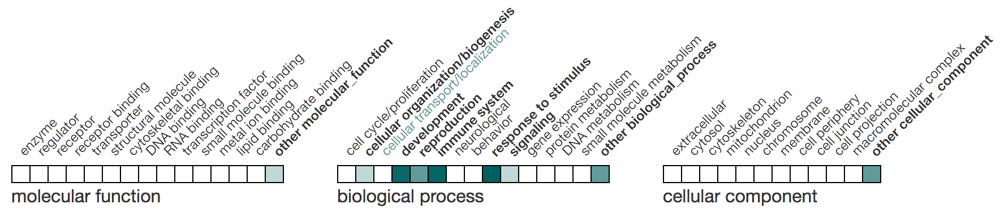

# react-ontology-ribbon

[![Travis][build-badge]][build]
[![npm package][npm-badge]][npm]
[![Coveralls][coveralls-badge]][coveralls]

A React component for generating a heatmap type display for ontology slims.

## Description

This component generates a heatmap display (ribbon) for ontology term summaries (slims).
It was designed for summarizing [Gene Ontology](http://geneontology.org/) 
terms, but it can be used with any ontology.



## Getting started

In your React project, add `@flybase/react-ontology-ribbon` via npm/yarn.

`npm install @flybase/react-ontology-ribbon`

`yarn add @flybase/react-ontology-ribbon`

Then you can use it in a React component such as.

```JSX
import React from 'react';
import {render} from 'react-dom';

import Ribbon from '@flybase/react-ontology-ribbon';
import '@flybase/react-ontology-ribbon/style.css';

const MyRibbon = () => {
    const goData = [
        { id: 'GO:12345',
        name: 'a_go_slim_term_name',
        descendant_terms: [
          { id: 'GO:33333', name:'a_descendant_term_1'},
          { id: 'GO:33334', name:'a_descendant_term_2'},
          { id: 'GO:33335', name:'a_descendant_term_3'},
        ]
        }
    ]; 
    return (
      <div>
        <Ribbon data={goData} />
      </div>
    );
  }
}

render(<MyRibbon />, document.querySelector('#root'));

```

## Demo

Steps to running the demo locally

```bash
git clone https://github.com/FlyBase/react-ontology-ribbon.git
cd react-ontology-ribbon
yarn install
yarn run start
```

Browse to whatever URL is indicated on your screen.

## Properties

The Ribbon component takes the following properties.

| Name | Description | Type |  Default |
|:-----|:------------|------|:--------|
| data | The slim terms (see below) | Array of objects |  |
| heatLevels | The number of gradients to use in the heatmap | number | 8 |
| baseRGB | The RGB values that the gradient is based on. | Array of RGB numbers | [0,96,96] |
| noResults | Content to display if no data is supplied | String or custom component|  |
| title | Label to appear underneath the ribbon | String or custom component | |
| onTermClick | Callback called when the term is clicked | Function | |
| calcHeatColor| A function to override the default heat color calculation. | Function | |
| itemTitle | A function to generate a custom title for each ribbon item. | Function | Term name: Number of terms|

## onTermClick callback

This callback is called when the block or text label for the block is clicked.
It is passed the object that represents the slim term as the first argument
and the event object as the second.

```JSX
const handleOnClick = (term, evt) => {
  console.log("Term ID " + term.id);
  console.log("Term name " + term.name);
  console.log("# Descendant terms " + term.descendant_terms.length);
}
```

Then you can add it to your ribbon.

```JSX
<Ribbon data={mydata} onTermClick={handleOnClick} />
```

## calcHeatColor

The property calcHeatColor can be used to pass in a custom function that
will be used to calculate the color for the ribbon cell.  The function is passed an object
with 4 key variables: numTerms, baseRGB, heatLevels, itemData.

| Name | Description | Type |
|:-----|:------------|------|
| numTerms | The number of descendant terms for this item. | number |
| baseRGB | The baseRGB value currently set. | Array of RGB numbers |
| heatLevels | The heatLevels currently set. | number |
| itemData | The data for the current item being drawn | Object |

```JSX
const customColorCalculation = ({numTerms, baseRGB, heatLevels, itemData }) => {
  if (itemData.name === 'reproduction') {
    return [120,120,120]
  }
  else if (numTerms > 5) {
    return [0,0,0]
  }
  return [255,255,255]
}
```

## itemTitle

In order to disable the item title attribute, pass a function that returns an empty string or null.

```JSX
  <Ribbon
    title="my title 3"
    data={SampleData}
    heatLevel={20}
    baseRGB={[153,0,0]}
    onTermClick={this.handleOnClick}
    itemTitle={() => null}
  />
```

## Data object structure.

The data property takes an array of objects that describes the ontology slim that we are 
generating a ribbon for.  Each object has 3 properties, an `id`, a `name`, and `descendant_terms`.
The first two properties are strings while `descendant_terms` is an array of terms contained by
this slim term.  The objects in the `descendant_terms` array must contain an `id` and `name` field as well.

e.g.

```JSON
[
  {
    "id": "GO:0023052",
    "name": "signaling",
    "descendant_terms": [
      {
        "id": "GO:0007179",
        "name": "transforming growth factor beta receptor signaling pathway"
      },
      {
        "id": "GO:0030509",
        "name": "BMP signaling pathway"
      },
      {
        "id": "GO:0061353",
        "name": "BMP signaling pathway involved in Malpighian tubule cell chemotaxis"
      }
    ]
  },
  {
    "id": "GO:0019538",
    "name": "protein metabolism",
    "descendant_terms": []
  },
  {
    "id": "GO:0050896",
    "name": "response to stimulus",
    "descendant_terms": [
      {
       "id": "GO:0016055",
       "name": "Wnt signaling pathway"
      }
    ]
  }
]
```

[build-badge]: https://img.shields.io/travis/FlyBase/react-ontology-ribbon/master.png?style=flat-square
[build]: https://travis-ci.org/FlyBase/react-ontology-ribbon

[npm-badge]: https://img.shields.io/npm/v/npm-package.png?style=flat-square
[npm]: https://www.npmjs.org/package/@flybase/react-ontology-ribbon

[coveralls-badge]: https://img.shields.io/coveralls/FlyBase/react-ontology-ribbon/master.png?style=flat-square
[coveralls]: https://coveralls.io/github/FlyBase/react-ontology-ribbon
